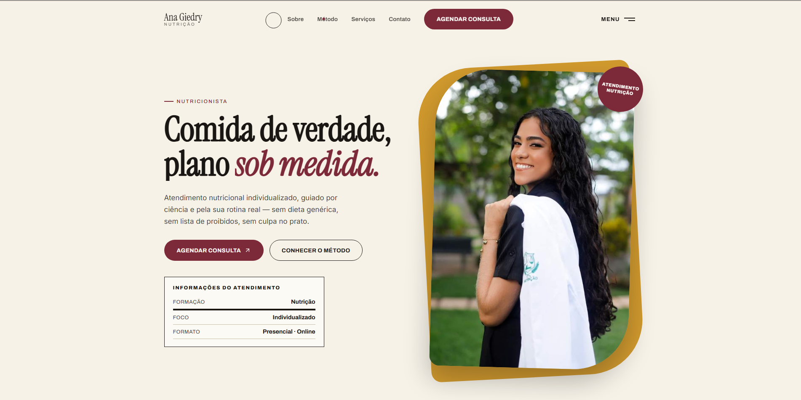

# 🥗 Ana Giedry — Nutrição e Bem-Estar

Landing page profissional desenvolvida para serviços de atendimento nutricional individualizado, unindo ciência, rotina real e uma abordagem sem dietas restritivas ou culpa.

---

## 📸 Demonstração do Projeto

<div align="center">
  
</div>

---

## 🚀 Tecnologias Utilizadas

Este projeto foi construído utilizando tecnologias modernas do ecossistema front-end:

* **Framework/Biblioteca:** React, JavaScript / TypeScript
* **Estilização:** Tailwind CSS / CSS Modules (com identidade visual acolhedora em tons claros e detalhes em vinho/terroso)
* **Hospedagem & Deploy:** Vercel

---

## ⚙️ Principais Funcionalidades

* **Design Responsivo:** Layout adaptado com fluidez para diferentes tamanhos de tela (computadores, tablets e smartphones).
* **Identidade Visual Acolhedora:** Paleta de cores planejada para transmitir profissionalismo, leveza e confiança.
* **Apresentação de Serviços & Metodologia:** Seções estruturadas detalhando a filosofia de trabalho, o método individualizado e os formatos de atendimento (presencial e online).
* **Contato e Agendamento Direto:** Canais integrados na interface para facilitar a conversão e o agendamento de consultas.

---

## ⚙️ Como Executar o Projeto Localmente

Certifique-se de ter o [Node.js](https://nodejs.org/) instalado em sua máquina.

1. **Clone o repositório:**
   ```bash
   git clone [https://github.com/gidelmarjr-art/ana-giedry-nutri.git](https://github.com/gidelmarjr-art/ana-giedry-nutri.git)